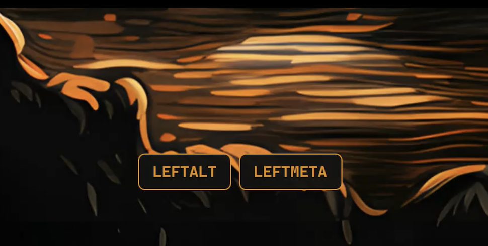

# Keycast

<p align="center">
  
</p>

**Keycast** is an [Omarchy](https://omarchy.org) shell plugin that shows each
key you press — `LEFTCONTROL`, `RIGHTALT`, `A`, `SPACE` — as a pill fading in
bottom-centre. Handy for screencasts, pairing, and teaching.

| Mode | Behaviour |
|------|-----------|
| **stream** | each keypress is its own pill; the row fades ~1 s after the last key |
| **chords** | modifiers held when a non-modifier is pressed are joined with `+` (`LEFTCONTROL+LEFTSHIFT+A`); a modifier tapped alone shows on its own |
| **caption** | a running line of the last ~14 keys, cleared after ~3 s idle |

## Requirements

- [keyd](https://github.com/rvaiya/keyd) installed and running — Keycast reads
  its `keyd monitor` stream for normalised key names.
- Your user in the **`input`** group, so `keyd monitor` can read
  `/dev/input/event*`.
- Omarchy v4 ("Quattro") or newer.

Don't have keyd yet? See [Setting up keyd](#setting-up-keyd) below.

## Install

```bash
omarchy plugin add https://github.com/brupm/omarchy-keycast
omarchy plugin enable io.github.brupm.keycast
```

The shell hot-reloads — no restart needed. Press a few keys and pills appear.

## Setting up keyd

```bash
omarchy pkg add keyd   # or: sudo pacman -S keyd
```

Add a pass-through config that remaps nothing:

```ini
# /etc/keyd/default.conf
[ids]
*

[main]
```

Enable the service and add yourself to the `input` group:

```bash
sudo systemctl enable --now keyd
sudo gpasswd -a "$USER" input
```

**Log out and back in** (or reboot) — restarting the shell alone won't pick up
the new group. Verify with:

```bash
grep Groups "/proc/$(pgrep -x Hyprland)/status"   # should include the input gid
```

## Cycling modes

The active mode lives in `~/.config/omarchy/keycast.json`:

```json
{ "mode": "stream" }
```

Edit it by hand (applies live), or bind a key to cycle
`stream → chords → caption`. In `~/.config/hypr/bindings.lua`:

```lua
o.bind("SUPER + SHIFT + K", "Keycast: cycle mode",
  "omarchy-shell -q keycast cycleMode")
```

Each cycle flashes a `KEYCAST: <MODE>` pill so you can see where you landed.

## Removal

```bash
omarchy plugin disable io.github.brupm.keycast
omarchy plugin remove io.github.brupm.keycast
rm -f ~/.config/omarchy/keycast.json
```

To undo the keyd setup, if nothing else uses it:

```bash
sudo gpasswd -d "$USER" input
sudo systemctl disable --now keyd
omarchy pkg drop keyd
```

## How it works & security

Keycast spawns `keyd monitor` as a child of the shell process and parses its
stdout. keyd normalises names (`leftcontrol`, `rightalt`, …) and reports its
*effective* output, so remaps configured in keyd show through as what
applications actually receive.

- **No network access** — nothing is sent anywhere.
- **No logging or persistence of keystrokes** — pills live in memory for
  about a second.
- **Passwords are not masked.** Turn Keycast off (or stop recording) before
  typing secrets.
- The only file it writes is `~/.config/omarchy/keycast.json` — its own mode
  state, created only if missing.
- Like every Omarchy plugin, it runs unsandboxed with your user's permissions.

## License

MIT — see [LICENSE](LICENSE).
